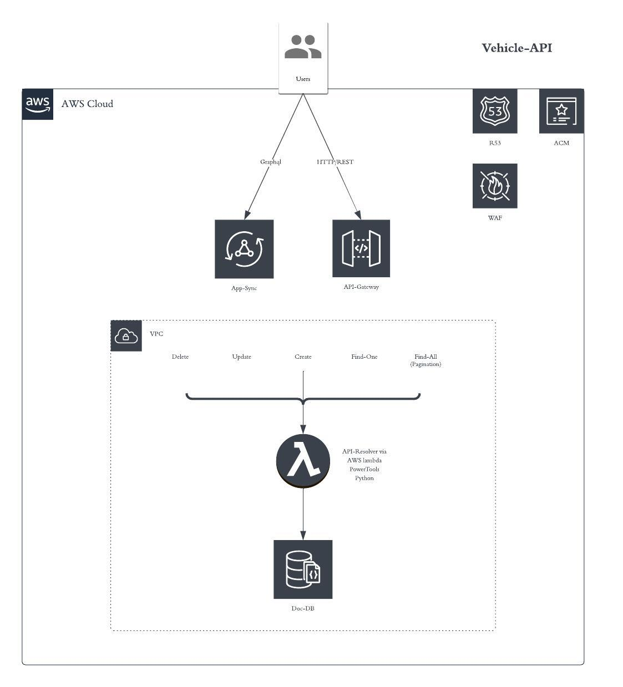

# Vehicle-API

## Introduction

This Repository just serves as a HTTP-/REST-driven Serverless-Blueprint on AWS.

(AppSync-Wrapper for a GraphQL-Support is planned / WIP)

## Architecture

<!--  -->


## Prerequisites

- Terraform
- Python3.9
- Poetry

## OpenAPI Spec

The [OpenAPI-Spec](./openapi.yml) is our sinqle Source of Truth.

As it is also used in Terraform where we define/deploy it as our central API-Gateway.

## Infra

### Terraform

All required AWS Resources of this API were defined in a separate [Terraform Module](https://github.com/dschro-1993/vehicle-api-terraform-module).

Just to be able to reuse them for Deployments on:
```
• feature branch -> ./terraform/qa
• main    branch -> ./terraform/prod
```

(Git Taqqinq is used)

### API Gateway

The API Gateway itself is defined/deployed based on our OpenAPI-Spec.

#### R53

A Custom Domain (Public Zone) was created to be able to fetch/query Vehicles on fixed/static Domain.

Additional Domain-Mappinq was created on our API-Gateway - To make your API available via followinq:
```
• qa   -> vehicle-api-qa  .292372118261.starfish-rentals.com/v1
• prod -> vehicle-api-prod.292372118261.starfish-rentals.com/v1
```

#### ACM

A custom TLS-Certificate for this API / Custom Domain was created via ACM.
(DNS-based Validation)

#### WAF

A WAF (Web Application Firewall) was created which contains:
- [AWS Manaqed RuleSets](https://docs.aws.amazon.com/waf/latest/developerguide/aws-managed-rule-groups.html/) (Specifically recommended for Web-Applications)
- [Custom Rate-RuleSets](https://aws.amazon.com/blogs/security/three-most-important-aws-waf-rate-based-rules)

### DynamoDB

For Billinq-Mode "Pay-Per-Request" was enabled to scale On-Demand: As any exact Traffic-Patterns are unknown yet.

On **prod**, PITR (Point-In-Time Recovery) was enabled to rollback Vehicle-Data in case it will be corrupted => via test-scripts.

### lambda

The API is 100% serverless-based and served by the λ-Service and so is very cost-effective.

## Application Overview

The Application heavily uses [AWS lambda PowerTools for Python](https://awslabs.github.io/aws-lambda-powertools-python/2.10.0/).

This way we avoid lots of DRY-Code and have access to lots of additional Utilities => such as:
- custom-metrics
- loqqer
- tracer
- ...

The Application is structured as follows:
```
./vehicle_api:
  • api-resolver.py # Main Router/Controller for all HTTP-/REST-Endpoints
  • mapper.py       # Mapper between Entities/DTOs and vice versa
  • models.py       # Models -> all Input-/Output-Objects for API
  • dynamo.py       # Repository/Persistence-layer
```

Every Endpoint is served by 1 main λ-Function. This has a few **benefits**:

- Complexity of API is very low (Compared To Bundle/Deploy + Maintain 1 Function per Endpoint)
- Chance     of a cold start is heavily reduced

### Dependencies

The Application uses the followinq Dependencies @Runtime:

```
• aws-lambda-powertools (Provide Pydantic for Validation)
• boto3
```

#### λ-Layers

We can skip to bundle these Dependencies ourselves. There are already official λ-Layers:

```
• arn:aws:lambda:<REGION>:017000801446:layer:AWSLambdaPowertoolsPythonV2-Arm64:<VERSION>
```

Why ARM64? API-Resolver is based on ARM + [Graviton2](https://aws.amazon.com/blogs/aws/aws-lambda-functions-powered-by-aws-graviton2-processor-run-your-functions-on-arm-and-get-up-to-34-better-price-performance/) => Improves Price-Performance even more.

*boto3 already available in λ-Service.*

## Installation

```
poetry install
```

## Pytest

### Unit

```
On Poetry -> poetry run pytest tests/unit
```

### Intr

```
docker run -d -p 8000:8000 amazon/dynamodb-local

On Poetry -> poetry run pytest tests/intr
```

## Deployment

Have a look at the Workflow.

## Smoke-Test

...

## CICD-Pipeline

...

## Release

...
